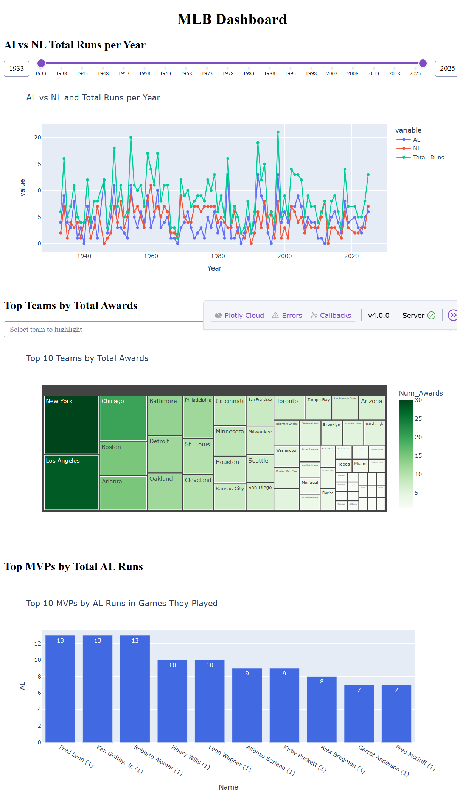

# MLB Data Project

## Overview

This project collects, cleans, stores, queries, and visualizes Major League Baseball (MLB) historical data using Python and SQLite.

The workflow includes web scraping, data import and cleaning, SQL queries, and interactive dashboards built with Dash and Plotly Express

## Live Demo

https://mlb-history-project.onrender.com/

## Dashboard Screenshot 

## Project Structure

- `scraper.py` - Scrapes MLB data from web sources
- `import_db.py` - Imports data into SQLite and performs cleaning and transformation
- `query_db.py` - Command-line program for querying the database (including JOIN queries)
- `dashboard.py` - Interactive dashboards using Dash and Plotly Express
- `mlb_history.db` - SQLite database

## Built with

- Python
- SQLite
- Pandas
- SQL
- Dash
- Plotly Express

## What This Project Demonstrates

- Web scraping 
- Data Cleaning and Preparation
- Database management
- SQL filtering and JOIN operations 
- Command-line interface
- Interactive data visualization

## How to Run

Run the scraper:
- `python scraper.py`

Import and clean data:
- `python import_db.py`

Run the query program:
- `python query_db.py`

Run the dashboard:
- `python dashboard.py`

## Author
Aiperi Amanturova(Lizard)